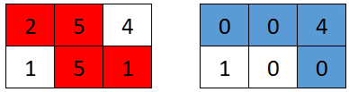
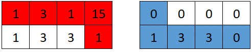

# Grid Game

**Difficulty:** Medium  
**Topics:** Array, Matrix, Prefix Sum

## Problem Description

You are given a **0-indexed** 2D array `grid` of size `2 x n`, where `grid[r][c]` represents the number of points at
position `(r, c)` on the matrix. Two robots are playing a game on this matrix.

Both robots initially start at `(0, 0)` and want to reach `(1, n - 1)`. Each robot may only move to the **right** (
`(r, c)` to `(r, c + 1)`) or **down** (`(r, c)` to `(r + 1, c)`).

At the start of the game, the **first robot** moves from `(0, 0)` to `(1, n - 1)`, collecting all the points from the
cells on its path. For all cells `(r, c)` traversed on the path, `grid[r][c]` is set to `0`. Then, the **second robot**
moves from `(0, 0)` to `(1, n - 1)`, collecting the points on its path. Note that their paths may intersect with one
another.

The **first robot** wants to **minimize** the number of points collected by the **second robot**. In contrast, the *
*second robot** wants to **maximize** the number of points it collects. If both robots play optimally, return the *
*number of points** collected by the second robot.

---

## Input / Output Format

**Input Format:**

* The first line of input contains a single integer `n` (the number of columns).
* The next 2 lines of input contain `n` space-separated integers representing the rows of the grid.

**Output Format:**

* Return the number of points obtained by the second robot.

---

## Examples

### Example 1

**Input:**

```text
3
2 5 4
1 5 1
```

**Output**

```
4
```

#### Explanation



### Example 2

**Input:**

```
4
1 2 1 15
1 3 3 1
```

**Output**

```
    7
```




**Constraints**

```
1 <= n <= 5*104
1 <= grid[r][c] <= 105
```
