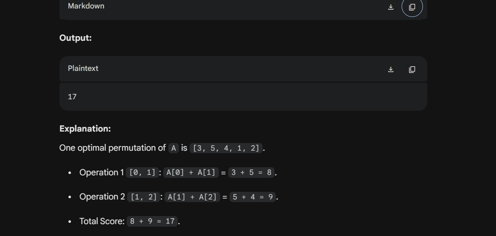

# Maximum Sum

**Difficulty:** Medium  
**Max Score:** 40  
**Companies:** Microsoft, Walmart Global Tech, DE Shaw, Flipkart, Samsung, Oracle, Visa, VMware, Snapdeal, Ola, Zoho,
Oyo Rooms  
**Topics:** Greedy, Arrays, Sorting, Prefix Sum

## Problem Description

You are given an array `A` of `N` integers. You are also given another array `ops` describing operations where
`ops[i] = [l, r]`. Both `l` and `r` are 0-indexed.

For every pair in `ops`, you must calculate the sum of elements from index `l` to `r` inclusive:
`A[l] + A[l+1] + ... + A[r]`.

Your score is the total sum of all the answers from `ops`. You are allowed to rearrange the array `A` in **any order**
to maximize this score.

Since the answer can be very large, return it modulo `1000000007` ($10^9 + 7$).

---

## Input / Output Format

**Input Format:**

* The first line contains a single integer `N`.
* The second line contains `N` space-separated integers of array `A`.
* The next line contains a single integer `M` denoting the number of operations.
* The next `M` lines contain two integers each, representing `l` and `r` for the `ops` array.

**Output Format:**

* Print the maximum possible sum modulo `1000000007` in a new line.

---

## Examples

### Example 1

**Input:**

```text
5
2 1 3 5 4
2
0 1
1 2
```

