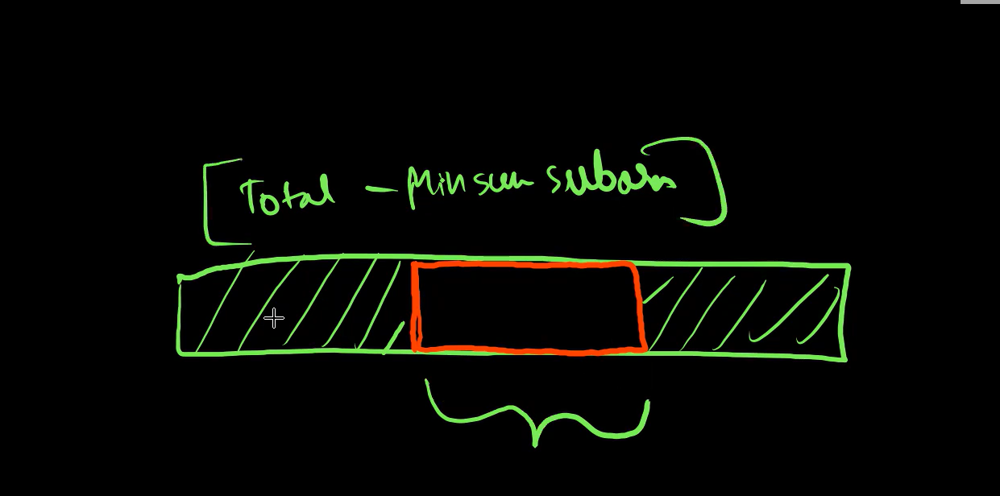

# Points to remember

- 1] Whole Array is MSS all are Positive
- 2]All are negative -> MSS = MAX_ELEMENT
- 3] If MSS is in Array itself -> Kadanes
- 4] case 4
- it will be using kadanes Algorithm
- but you'll have to calculate the MINIMUM SUM Subarry and
- have to substract it from total sum.
- `maximSumCircularSubarray=Total - MINIMUMSUMSUBARRAY`

# Time Complexity O(N)

- as we are

# Space Complexity O(N)

- as we are

# Solution