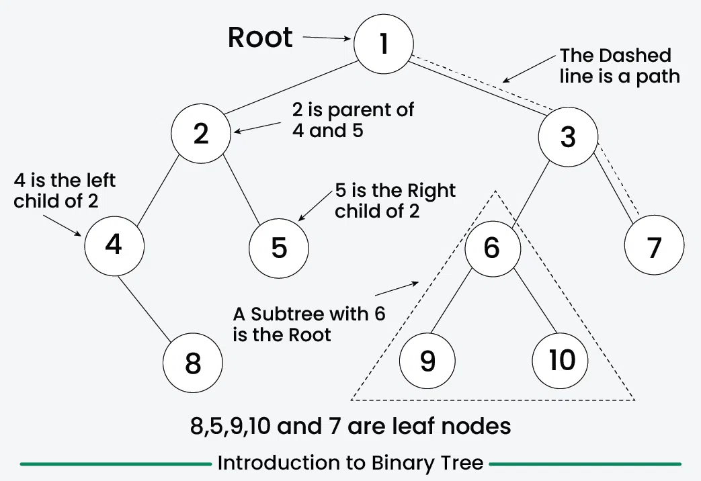
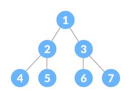
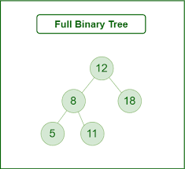
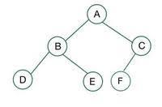
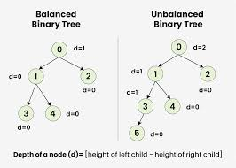
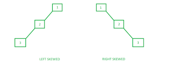

---

## Terminologis of Binary Tree

### Root Node

- Root is the node which don't have any parent.

### Child Node

- A Node has some parent is know as child Node.

### Leaf Node

- A Node which don't have any child then it's called leaf Node.

### Subtree

- it is part of tree and every node including it's child nodes is a subtree.

### Siblings Nodes

- the Nodes pointing to the same parent are know as Siblings.

### Degree

- Number of a child of a Node is know as degree of the Child.
- in Binary tree it may be `0`,`1`,`2`

### height Of Binary Tree

- Distance between root node and deepest leaf node in `terms of edges` is know as Height of Binary Tree.

---

## Type Of Binary Trees

### Perfect Binary Tree

- A tree where Number of Node at level h are `2^h` then it's called as perfect Binary Tree.
- Every level is completely Field or Empty.
- 

### Full Binary Tree

- A Binary Tree where each node has either two or no child Nodes.
- 

### Complete Binary Tree

- A binary tree where each level is completely Filled except last level and the nodes in the last level are as left as
  possible.
- 

### Balance Binary Tree

- For each node the difference between height of left subtree and right subtree is `<= 1`
- `|h1-h2| <= 1`
- h1 -> height of left subtree
- h2 -> height of right subtree
- 

### Skew Tree

- When the tree have either left or right child then it is Skewed tree.
- 
