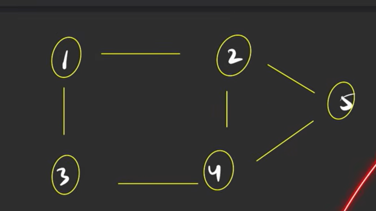
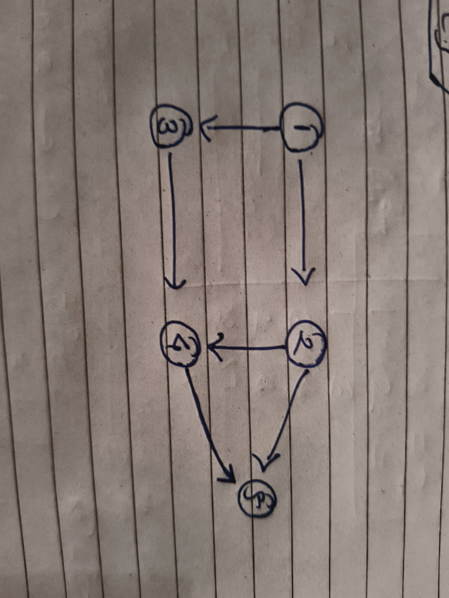
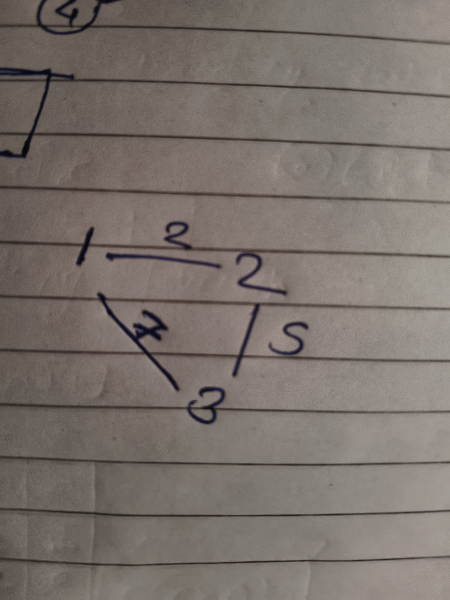

### Two ways to Represent the Graph

### 1] Adjacency Matrix

- It's SpaceComplexity is `O(N2)`
- that's why not recommended but you can use for small graphs.

```java
public static void main(String[] args) {
    int n = 3, m = 3;
    int[][] adj = new int[n + 1][n + 1];

    /**
     * edge 1---2
     */
    adj[1][2] = 1;
    adj[2][1] = 1;

    /**
     * edge 2---3
     */
    adj[2][3] = 1;
    adj[3][2] = 1;

    /**
     *edge 1---3
     */
    adj[1][3] = 1;
    adj[3][1] = 1;

}
```

---



### 2] Adjacency List

- It is `ArrayList<ArrayList>>`
- for every edge you are storing two nodes
- so Space Complexity would be 2*Number of Edges(M)`O(2M)` which is `O(M)`

```java
import java.util.ArrayList;

/**
 * This is For Directed graphs
 * @param args
 */
public void forUndirectedGraph(String[] args) {
    ArrayList<ArrayList<Integer>> adj = new ArrayList<>();
    /**
     * will be adding n+1 Arraylists as we are following 1 based indexing
     */
    for (int i = 0; i <= n; i++) adj.add(new ArrayList<>());
    /**
     * for edge 1---2
     */
    adj.get(1).add(2);
    adj.get(2).add(1);
    /**
     * edge 1---3
     */
    adj.get(1).add(3);
    adj.get(3).add(1);
    /**
     * edge 2---5
     */
    adj.get(2).add(5);
    adj.get(5).add(2);
    /**
     * edge 2---4
     */
    adj.get(2).add(4);
    adj.get(4).add(2);

    /**
     * edge 4---5
     */
    adj.get(4).add(5);
    adj.get(5).add(4);
    /**
     * edge 4---3
     */
    adj.add(4).add(3);
    adj.add(3).add(4);


}
```



```java
/**
 * for Directed Graph
 * @param args
 */
public void forDirectedGraph(String[] args) {
    ArrayList<ArrayList<Integer>> adj = new ArrayList<>();
    /**
     * will be adding n+1 Arraylists as we are following 1 based indexing
     */
    for (int i = 0; i <= n; i++) adj.add(new ArrayList<>());
    /**
     * for edge 1--->2
     */
    adj.get(1).add(2);
    /**
     * edge 1--->3
     */
    adj.get(1).add(3);
    /**
     * edge 2--->5
     */
    adj.get(2).add(5);
    adj.get(5).add(2);
    /**
     * edge 2--->4
     */
    adj.get(2).add(4);

    /**
     * edge 4--->5
     */
    adj.get(4).add(5);
    /**
     * edge 4--->3
     */
    adj.add(3).add(4);

}

```

---

### For Weighted Graph

#### By Adjacency Matrix



```java
public static void main(String[] args) {
    int n = 3, m = 3;
    int[][] adj = new int[n + 1][n + 1];

    /**
     * edge 1---2
     */
    adj[1][2] = 2;
    adj[2][1] = 2;

    /**
     * edge 2---3
     */
    adj[2][3] = 5;
    adj[3][2] = 5;

    /**
     *edge 1---3
     */
    adj[1][3] = 7;
    adj[3][1] = 7;

}
```

#### By Adjacency List

- Instead of Storing Single Data Neighbour value
- you can Store Pairs

```java
public static void main(String[] args) {
    ArrayList<ArrayList<Pair>> adj = new ArrayList<>();
    /**
     * will be adding n+1 Arraylists as we are following 1 based indexing
     */
    for (int i = 0; i <= n; i++) adj.add(new ArrayList<>());
    /**
     * for edge 1---2
     */
    adj.get(1).add(new Pair(2, 3));
    adj.get(2).add(new Pair(1, 3));
    /**
     * edge 1---3
     */
    adj.get(1).add(new Pair(3, 4));
    adj.get(3).add(new Pair(1, 4));
    /**
     * edge 2---5
     */
    adj.get(2).add(new Pair(5, 3));
    adj.get(5).add(new Pair(2, 3));
    /**
     * edge 2---4
     */
    adj.get(2).add(new Pair(4, 1));
    adj.get(4).add(new Pair(2, 1));

    /**
     * edge 4---5
     */
    adj.get(4).add(new Pair(5, 6));
    adj.get(5).add(new Pair(4, 6));
    /**
     * edge 4---3
     */
    adj.add(4).add(new Pair(3, 5));
    adj.add(3).add(new Pair(4, 5));
}
```


