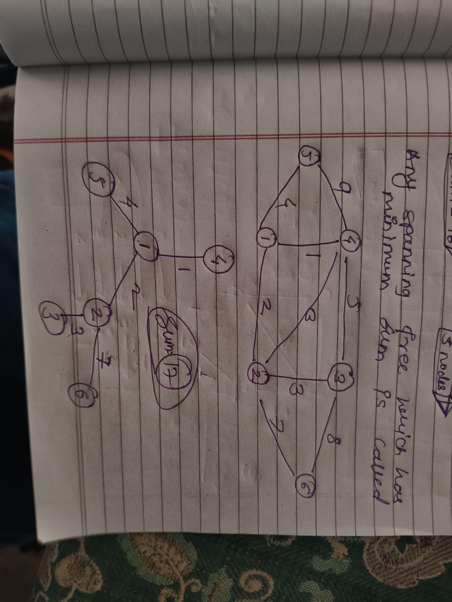

# Minimum Spanning Tree

- Any Spanning Tree which has minimum Sum is Called Minimum Spanning Tree.

## Spanning Tree

#### Def:

- A tree in which we have `n` nodes and `n-1` edges and All the Nodes are reachable from each other is Called Spanning
  Tree.

