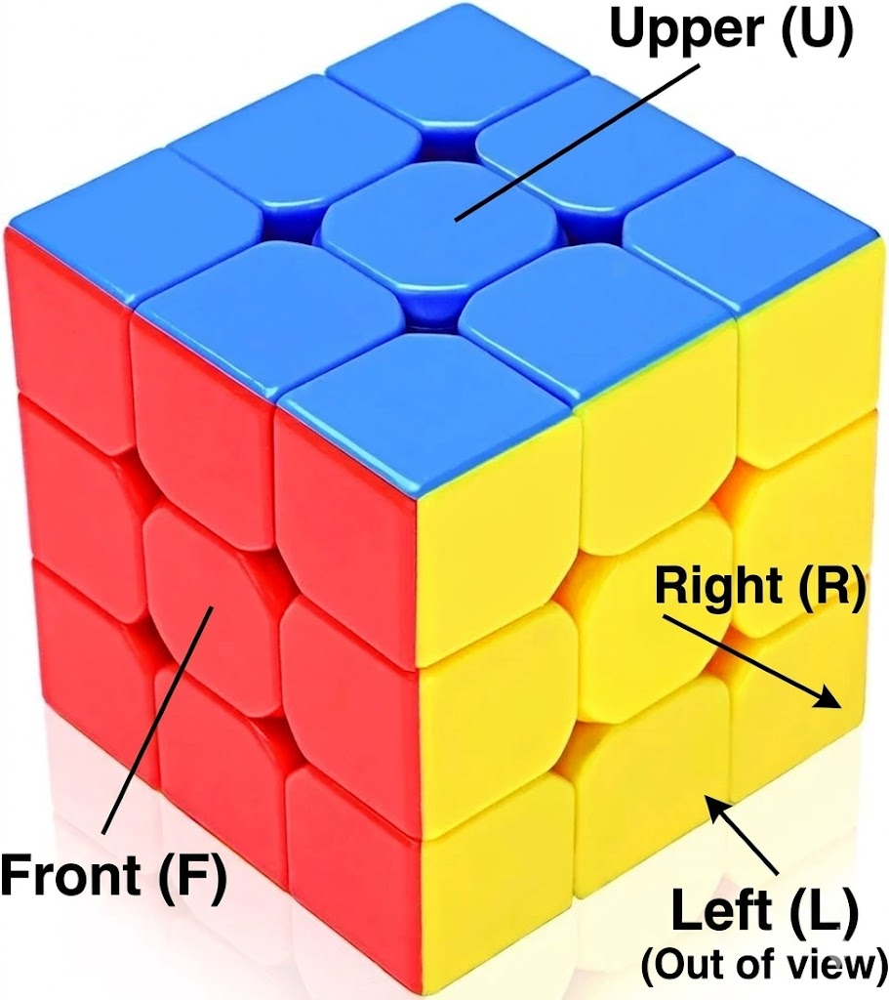

# Steps to Solve `3x3` Rubik’s Cube
- Make Plus Match the colors as well
- arrange all same colors for the `plus` row
- solve the middle row match all the colors
- make plus on top
- arrange them accordingly
- then arrange the corners and solve it.



# Formulas to be Remembered

### Plus
```
F -> R -> U -> R` -> U` -> F`
```

### Left Shift
```
U -> L` -> U ->  L -> U -> F -> U` -> F`
````

### Right Shift
```
U -> R -> U` -> R` -> U` -> F` -> U -> F
```

### Set Middle Edges for top most Layer
```
R -> U` -> U` -> R` -> U` -> R -> U` -> R` -> U`
```

### Corners
```
L`-> U -> R -> U` -> L -> U -> R` -> U`
```

### Finishing
```
R` -> D` -> R -> D
```
